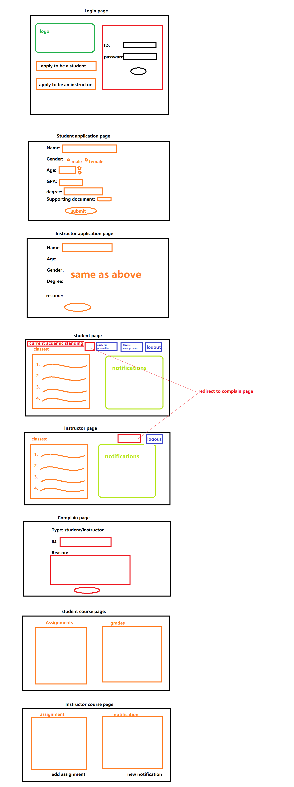

# GradSchoolZero
A graduate system would allows students and instructors to manage their courses.

## Table of Contents
1. [Overview](#Overview)
1. [Product Spec](#Product-Spec)
2. [Use Case](#Use-Case)
3. [Wireframes](#Wireframes)

## Overview
### Description
GradSchoolZero is a graduate program management system. It is used to handle all the details about students, instructors, and courses. The details included: Student personal/academic information, Instructor/personal/academic information, Course details, and Academic details.

### Framework Used
Django

### Purpose
The purpose of this SRS is to provide an outline of a software product. Including design decisions, architectural design, and information needed for software support.

### Type of Users
- **Visitor:** A vistor can view the general info page of the website and apply to be a student and instrutor
- **Student:** A student can use a student account to access to the student page
- **Instructor:** An insturctor can use a instuructor account to access to the instructor page
- **Admin/Register:** Register can manage basically anything in the system including period change

### Project Evaluation
- **Category:** Student Information System
- **Website:** This project would be primarily developed for web use. Data used in the project will be connected and stored to the database using mySQL. 
- **Story:** Provide a platform for academic related use.
- **Market:** Any individual could choose to use this app, and to keep it a safe environment. People who needs a student information/courses management system can use this app to acheive their goal.
- **Scope:**  The scope of this project is a web-based system that provides a platform directly to students, instructors, visitors, and registrars. Visitors will be able to see some basic information about the college/University and decide whether or not they want to apply to be a student or instructor. The students and instructors will be able to see their current courses and their academic detail. And registrars will be able to make decisions and manage the students/instructors.

## Product Spec

### 1. Specific Requirements

- [x] Have a GUI with a general introduction of the program, these information are availableto all users.
    - [x] Included the highest-rated class. 
    - [x] Included the lowest rated classes.
    - [x] Shows students with the highest GPA. 
- [x] Applications for students and instructors :
    - [x] A visitor can apply to be a student of the college.
    - [x] Only the registrar can decide to accept or reject the applications.
    - [x] Any students whose GPA is > 3.0 and the program quota is not reached should be accepted, and rejected otherwise. 
    - [x] If the registrar made a decision against this rule, s/he should provide a justification to the applicant. 
    - [x] Accepted new students will receive a unique student id and password that should be changed in the first login. 
    - [x] A visitor can also apply to be an instructor that is also decided by the registrars for approval or rejection without the need of justification
    - [x] approved instructors will be assigned class(es).
 
- [x] After logging in => In student or instructor's main page:
    - [x] An instructor has his/her own page that can see all the basic info and the academic records of the students in his /her current class(es);
    - [x] A student has his/her own page that can see his/her own records, 
    - [x] A new student will be given a tutorial on how to use the system
    - [x] A registrar can see everything.

- [x] A semester goes by 4 periods managed by registrars: class set-up period, course registration period, class running period, and grading period. 
    - [x] During the class set-up period, the registrars set up classes, class time, course instructors, and class size.
    - [x] Afterward enters the course registration period, when all matriculated students can register between 2-4 courses 
    - [x] Courses can only be register if:
         1) There is no time conflict among chosen classes; 
         2) The upper limit of the course is not reached--if the limit is reached, the student is put in the wait-list that only the course instructor can let in. 
         3) A student can retake the same class if s/he got F before.
    - [x] During short registration Period: 
         1) Students who have less than 2 courses will be warned; 
         2) courses with less than 5 students will be canceled;
         3) those students of the canceled courses will be given one more chance to choose other courses 
         4) The instructors whose courses were canceled will be warned. 
         5) Instructors whose courses were all canceled will be suspended
         6) All suspended instructors cannot teach in the next semester.
    - [x] During the grading period, instructors assign grades.
         1) After this period ends, the instructors who didn't assign grades for all students will be warned. 
         2) Any instructor whose class GPA is above 3.5 or below 2.5 will be questioned by the registrars, without adequate justifications the instructor will be warned or fired right away. 
         3) Any students whose GPA is below 2 or who failed the same course twice will be terminated automatically; 
         4) those whose GPA is between (2, 2.25) will receive a warning demanding an interview with the registrars. 
         5) Students whose semester GPA is above 3.75 or overall GPA (>1 semester) higher than 3.5 will be labeled as honor roll students automatically, and one such honor can be used to remove one warning if there is any. 
         6) Students finishing 8 classes can apply for graduation, if the registrars find all required courses are covered the student will graduate and leave the system with a Master’s degree. Otherwise, the student receives a warning for reckless graduation application.
  
- [x] Student drop classes:
    - [x] A student can drop a class between registration and grading period with a grade of W.
    - [x] A student who dropped all courses will be suspended for one semester automatically unless the registrars take action.

- [x] Write a review for any courses that is current taking:
    - [x] A student who is in a class can write reviews of this class and assign starts(1 worst to 5 best)
    - [x] Which will be summarized in the class, no one else except the registrars knows who rated which class.
    - [x] The instructor of any course receiving an average rating of <2 will be warned. 
    - [x] An instructor who accumulates 3 warnings will be suspended. 
    - [x] The student cannot rate the class after the instructor posts the grade.
    - [x] Reviews with 1 or 2 taboo words(the list of taboo words are set up by registrars) will be shown but those words are changed to *** and the author receives one warning;
    - [x] whereas reviews >= 3 taboo words are not shown in the systems and the author will receive 2 warnings.

- [x] Student and instructor can send their complaints to the register , and registrar will process the complaints
    - [x] Willissue a warning to the student or the instructor based on the investigation. 
    - [x] Either punish the student accordingly or punish the instructor by one warning.
    - [x] Any students receiving up to 3 warnings will be suspended for 1 semester and must pay a fine to the registrars.
​
​

## Use-Case
### Student:
● Login
Students provide their username and password to login the account.
● Apply for graduation:Student
Student completed 8 courses can apply for guaduation
● View course
Student can view enrolled courses
● Add/drop course
Student can add or drop courses
● Complain
Student can complain instructors or other students in the same section
● See notification
Student can see notification from the register and instructor
● Rate a course
Student can rate a course currently taking

### Instructor:
● Login
Instructor provide their username and password to login the account.
● Give assignments to students
Instructor can send students notification to students to assign work
● Grade assignments
Instructor can give grades to student for classes teaching
● Send notification to students
Instructor can send notificaiton to students
● View student information that of his/her class
Instructor can see what students are in the class

### Visitor:
● View student information table
Vistor can see the top students and top classes in the system 
● Apply to be a student
Vistor can apply to be a student by submitting an application
● Apply to be an instructor
Vistor can apply to be an instructor by submitting an application
### Registrar:
● Accept or reject student or instructor application
Registrar can view and take action to account sign-up application
● Review and handle complains
Registrar can view and take action to complains received
● Add/edit users account information
Registrar can add and edit user account information
● Add new course
Registrar can add and edit new course
● Suspend or unsuspend student or instructor
Registrar can suspend and unsuspend students and instructors
● Send notification to students or instructors
Registar can sent notification to students and instructors

## Wireframes

